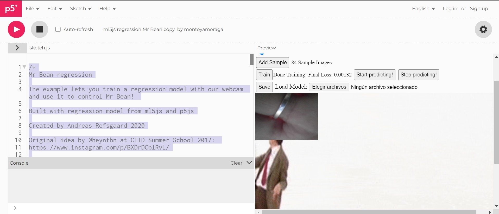
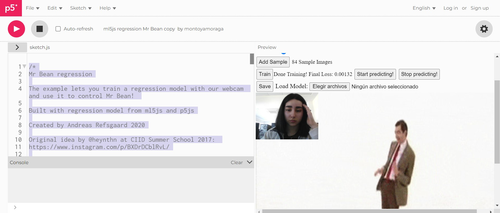
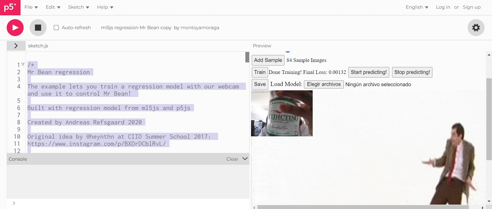

# clase-03
## Referentes 
* Gene Kogan: Matemático, trabaja un lenguaje entre programacion y artes.
* <https://genekogan.com/>
* Andreas Refsgaard: artista digital, diseñador, trabajo en openframeworks
* <https://www.andreasrefsgaard.dk/>
* Rafael Lozano: "la IA es una herramienta que solo deberian ocupar los artistas"
* <https://medium.com/processing-foundation/from-simple-to-advanced-ml5-js-70d6730b360b>

## Apuntes generales
* School of Machines, cursos breves de contenido poco comun
* processing = proce55ing = acortar el nombre = p5
* ml5
* Openframeworks: 
* ml4a <https://ml4a.net/> recursos de aprendizaje automatico de artes y creatividad
* YOLO: algoritmo lector de imagenes

## Ejercicio en clases
Proceso de actualizar un ejemplo de Andreas Refsgaard
Ejemplo de Mr Bean Regression disponible en <https://editor.p5js.org/AndreasRef/sketches/4K_YGuMik>

```
/*
Mr Bean regression

The example lets you train a regression model with our webcam and use it to control Mr Bean! 

Built with regression model from ml5js and p5js

Created by Andreas Refsgaard 2020

Original idea by @heynthn at CIID Summer School 2017: 
https://www.instagram.com/p/BXDrDCblRvL/

Original video source: https://www.youtube.com/watch?v=HCfrKGrjI2g
*/

let featureExtractor;
let regressor;
let video;
let loss;
let slider;
let samples = 0;

let lerpedResult = 0.5;
let allowedToPredict = true;

let images = [];
let nImages = 44;

let currentImage = 0;

function preload() {
  for (let i = 0; i < nImages; i++) {
    images[i] = loadImage("frame_" + i + "_delay-0.2s.jpg");
    images[i].resize(640, 480);
  }
}

function setup() {
  createCanvas(640, 480);
  // Create a video element
  video = createCapture(VIDEO, 640, 480);
  video.hide();
  // Extract the features from MobileNet
  featureExtractor = ml5.featureExtractor('MobileNet', modelReady);
  // Create a new regressor using those features and give the video we want to use
  regressor = featureExtractor.regression(video, videoReady);
  // Create the UI buttons
  setupButtons();
  rectMode(CENTER);
}

function draw() {
  image(images[currentImage], 0, 0, width, height);
  image(video, 0 * width / 4, 0 * height / 4, width / 4, height / 4);
  noStroke();
  fill(255, 0, 0, 100);
  currentImage = constrain(floor((1 - slider.value()) * nImages), 0, nImages - 1);
}

// A function to be called when the model has been loaded
function modelReady() {
  select('#modelStatus').html('Model loaded!');
}

// A function to be called when the video has loaded
function videoReady() {
  select('#videoStatus').html('Video ready!');
}

// Classify the current frame.
function predict() {
  allowedToPredict = true;
  regressor.predict(gotResults);
}

function stopPredicting() {
  allowedToPredict = false;
}

// A util function to create UI buttons
function setupButtons() {
  slider = select('#slider');
  select('#addSample').mousePressed(function() {
    regressor.addImage(slider.value());
    select('#amountOfSamples').html(samples++);
  });

  // Train Button
  select('#train').mousePressed(function() {
    regressor.train(function(lossValue) {
      if (lossValue) {
        loss = lossValue;
        select('#loss').html('Loss: ' + loss);
      } else {
        select('#loss').html('Done Training! Final Loss: ' + loss);
      }
    });
  });

  // Predict Button
  select('#buttonPredict').mousePressed(predict);
  select('#buttonStopPredict').mousePressed(stopPredicting);

  // Save model
  saveBtn = select('#save');
  saveBtn.mousePressed(function() {
    regressor.save();
  });

  // Load model
  loadBtn = select('#load');
  loadBtn.changed(function() {
    regressor.load(loadBtn.elt.files, function() {
      select('#modelStatus').html('Custom Model Loaded!');
    });
  });
}

// Show the results
function gotResults(err, result) {
  if (err) {
    console.error(err);
  }
  if (result && result.value && allowedToPredict) {
    lerpedResult = lerp(lerpedResult, result.value, 0.15);
    slider.value(lerpedResult);
    predict();
  }
}
```
Antes de comenzar a entrenar el algoritmo, se hicieron algunas modificaciones del software, y asi tener una version mas actualizada.

* Paso 1: tapar la camara, ubicar a Mr Bean al lado izquierdo de la pantalla


* Paso 2: mostrarme a mi, ubicar a Mr Bean al centro de la pantalla


* Paso 3: mostrar una botella, ubicar a Mr Bean al lado derecho de la pantalla


Finalmente comerzar a predecir con la camara web encendida, si el algoritmo logra reconocer al software entrenado.

## Terminos y simbologia
* uft-8 Sistema de unificacion de todos los caracteres del mundo
* Backtick, se puede agregar JavaScript o html, depende del codigo
* ctrl + A Copiar todo


